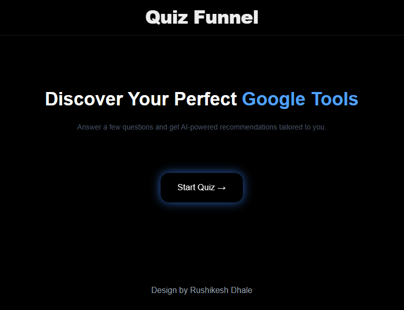
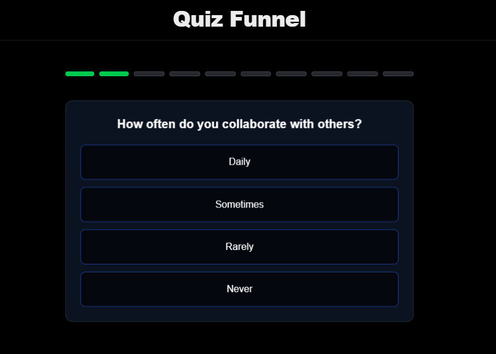
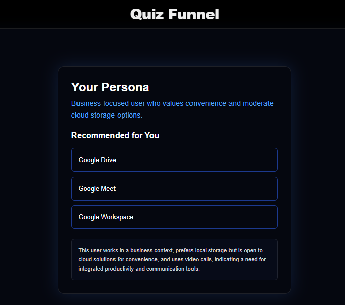

# 🚀 AI Quiz Funnel (Next.js 14)

An interactive **AI-powered quiz funnel application** that collects user preferences, analyzes them using LLMs via OpenRouter, and returns personalized recommendations with a modern SaaS-style UI.

👉 Live Demo: https://ninex-rushikeshdhale.vercel.app/

---

## 📸 Screenshots

### 🏠 Home Page


### ❓ Quiz Flow


### 🎯 Result Page (AI Output)


### 🎯 Progress Bar


---

## ✨ Features

- 🧠 AI-powered user analysis using OpenRouter LLMs
- ❓ Dynamic quiz flow (adaptive questions)
- 🎯 Personalized persona generation
- 📊 Smart recommendations engine
- ⏳ Beautiful loading state while AI processes response
- ⚡ Smooth animations with Framer Motion
- 📱 Fully responsive mobile-first design
- 🌑 Modern dark UI with glowing effects
- 💾 LocalStorage-based state persistence

---

## 🛠️ Tech Stack

### Frontend
- Next.js 14 (App Router)
- Tailwind CSS
- Framer Motion
- React Hooks (useState, useEffect)

### Backend / AI
- OpenRouter API
- GPT models (gpt-4o-mini / LLaMA variants)
- Next.js API Routes (`/app/api/analysis`)

### Tools
- LocalStorage
- Fetch API
- Vercel Deployment

---

## 📂 Project Structure
app/
├── api/
│ └── analysis/route.js # AI API endpoint
├── quiz/ # Quiz flow pages
├── result/ # Result page
├── components/
│ ├── Header.js
│ ├── QuestionCard.js
│ ├── ProgressBar.js
│ ├── Loader.js
├── lib/
│ └── questions.js
├── layout.js
├── page.js


---

## ⚙️ How It Works

1. User starts the quiz
2. Questions are dynamically rendered
3. Answers stored in localStorage
4. Data sent to OpenRouter API
5. AI returns structured JSON:
   - Persona
   - Recommendations
   - Reason
6. Loader is shown while waiting for AI response
7. Result page displays personalized output

---

## 🔌 AI Integration

OpenRouter API:
https://openrouter.ai/api/v1/chat/completions

Model used:
openai/gpt-4o-mini

---

## 📦 Setup Instructions

```bash
git clone https://github.com/your-username/quiz-funnel.git
cd quiz-funnel
npm install
npm run dev
